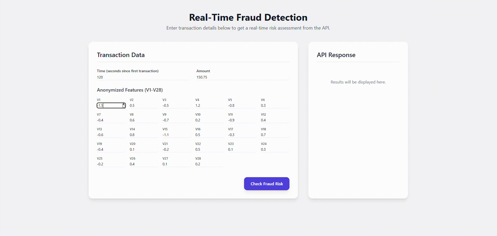

# Real-Time Fraud Detection API & UI

[](https://opensource.org/licenses/MIT)

A full-stack prototype of a real-time financial fraud detection system. The backend is a Python microservice built with **FastAPI** and containerized with **Docker**. The frontend is an interactive web application built with **Vue.js**.

---

## Database

This project used the Credit Card Fraud Detection (creditcard.csv) database from Kaggle (https://www.kaggle.com/datasets/mlg-ulb/creditcardfraud).

---

## Live Demo

Here is a quick demonstration of the system in action. The Vue.js frontend sends a transaction to the backend API, which returns a real-time risk assessment from the machine learning model.



---

## Overview

This project simulates a mission-critical financial service that scores credit card transactions for fraud risk in real-time. It's designed to be a scalable, deployable microservice that could be integrated into a bank's core transaction processing pipeline.

### Core Business Value
* **Mitigate Financial Loss:** Proactively identifies and flags potentially fraudulent transactions.
* **Production-Ready Mindset:** The system is fully containerized with Docker, demonstrating a modern, cloud-native approach to deployment.
* **Enterprise-Grade Tooling:** Utilizes modern, high-performance tools like FastAPI, Vue.js, and Scikit-learn, which are common in enterprise environments.

---

## Technology Stack

| Component | Technology | Purpose |
| :--- | :--- | :--- |
| **Backend API** | Python, FastAPI | High-performance, asynchronous API for serving the model. |
| **ML Model** | Scikit-learn, Pandas | Logistic Regression model for classification and data manipulation. |
| **Containerization** | Docker | Encapsulates the application and its dependencies for consistent deployment. |
| **Frontend UI** | Vue.js, Tailwind CSS | A responsive and interactive user interface for submitting transactions. |
| **Server** | Uvicorn | ASGI server to run the FastAPI application. |

---

## How to Run the System Locally

### Prerequisites
* Python 3.8+
* Docker Desktop running

### 1. Build the Docker Container

This command builds the Docker image for the API, installing all dependencies from `requirements.txt`.

```bash
docker build -t fraud-detection-api .

2. Run the Docker Container
This command starts the API service. The container will be exposed on port 8000 of the host machine.

docker run -p 8000:8000 fraud-detection-api

The API will now be running at http://localhost:8000.

3. Launch the Frontend
Simply open the index.html file in your browser to interact with the UI.

API Interaction (via cURL)
You can also interact with the API directly using cURL.

# Note for Windows PowerShell users: Use curl.exe
curl.exe -X 'POST' -H 'Content-Type: application/json' `
-d '{"Time": 120, "V1": -1.5, "V2": 0.5, "V3": -0.5, "V4": 1.2, "V5": -0.8, "V6": 0.3, "V7": -0.4, "V8": 0.6, "V9": -0.7, "V10": 0.2, "V11": -0.9, "V12": 0.4, "V13": -0.6, "V14": 0.8, "V15": -1.1, "V16": 0.5, "V17": -0.3, "V18": 0.7, "V19": -0.4, "V20": 0.1, "V21": -0.2, "V22": 0.5, "V23": 0.1, "V24": 0.3, "V25": -0.2, "V26": 0.4, "V27": 0.1, "V28": 0.2, "Amount": 150.75}' `
'http://localhost:8000/predict'

Example Response:
{
  "transaction_id": "a1b2c3d4-e5f6-a7b8-c9d0-e1f2a3b4c5d6",
  "risk_score": 0.0012,
  "is_fraud": false,
  "decision": "APPROVE",
  "confidence_level": 0.9988
}
